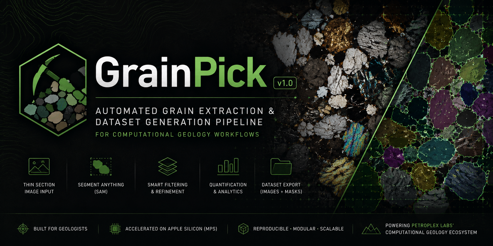
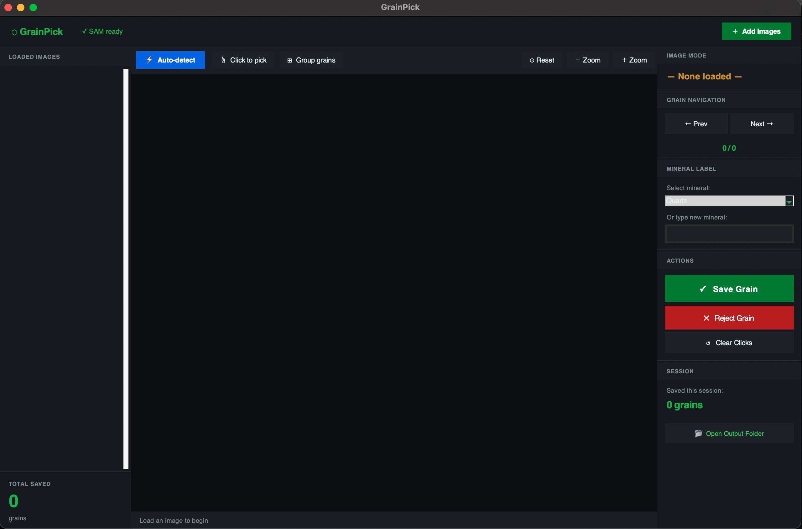
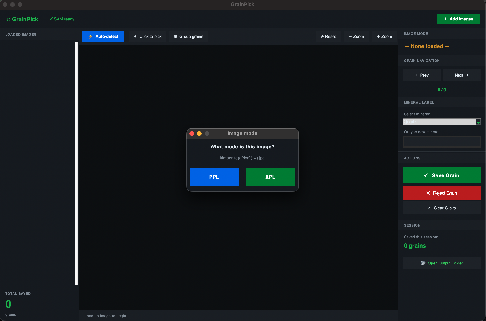
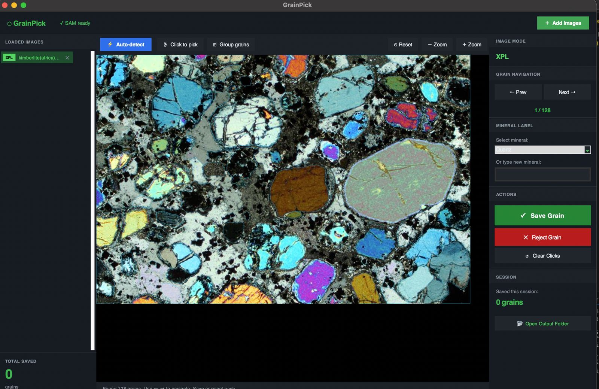
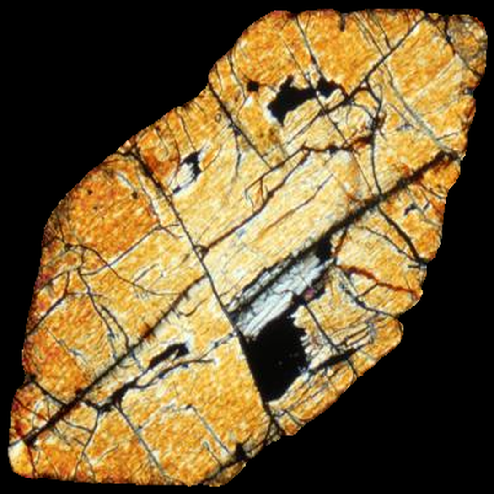

<p align="center">
  
</p>

# GrainPick — Thin Section Grain Extractor

Automated grain boundary detection and individual grain extraction from optical thin section images (PPL/XPL). Produces boundary-precise PNG crops ready for use as ML training data.

GrainPick streamlines grain extraction by combining automatic segmentation (SAM/OpenCV) with interactive geological review, enabling rapid generation of boundary-precise mineral grain datasets for machine learning applications.
---
## Interface Preview


### Interactive Review Interface


### XPL/PPL toggle menu


### Automatic Grain Detection


### Extracted Grain Outputs



## Features

- Automatic grain segmentation using Meta SAM
- Interactive correction workflow
- Transparent PNG grain exports
- Manifest-based dataset tracking
- GPU / CPU compatible
- Thin section workflow integration

## Quick start

```bash
# 1. Setup (run once)
bash setup.sh

# 2. Activate environment
source grainpick_env/bin/activate

# 3. Run on your image
python grainpick.py --image my_thin_section.jpg
```

---

## How it works

### Stage 1 — Automatic segmentation
On launch, SAM (Segment Anything Model) scans the entire image and proposes grain boundaries automatically. This typically takes 30–90 seconds depending on image size and your hardware.

If SAM is not installed, an OpenCV watershed fallback runs instead (faster but less precise on complex textures).

### Stage 2 — Interactive review
A window opens showing all detected grain outlines overlaid on your image.

| Color | Meaning |
|-------|---------|
| Yellow outline | Auto-detected, not yet reviewed |
| Green fill | Accepted & saved |
| Blue/red fill | Rejected |
| Cyan fill | Currently active grain |

### Stage 3 — Manual correction
For grains SAM missed or split incorrectly:
- **Left-click** on the grain → adds a positive point (include this region)
- **Right-click** → adds a negative point (exclude this region)
- SAM re-predicts the boundary live from your clicks
- Press **A** to accept the result

---

## Controls

| Key / Action | Effect |
|---|---|
| `A` | Accept current grain & save |
| `R` | Reject / skip current grain |
| `→` or `.` | Next auto grain |
| `←` or `,` | Previous auto grain |
| `N` | Clear manual points, start fresh |
| `U` | Undo last click point |
| `S` | Save manifest now |
| `Q` / `Esc` | Quit and save |
| Mouse wheel | Zoom in/out |
| Middle-click drag | Pan |
| Left-click (on image) | Add positive point |
| Right-click (on image) | Add negative point |

---

## Output

Each accepted grain is saved as:
- **PNG with transparency** — the grain itself is opaque, background is transparent (alpha channel = mask)
- Filename: `{source_image}_grain_{ID:04d}.png`

A `manifest.json` is also saved listing every grain with:
```json
{
  "file": "sample01_grain_0012.png",
  "grain_id": 12,
  "source": "auto",
  "label": "",
  "bbox": [x, y, width, height],
  "area_px": 4821
}
```

The `label` field is empty by default — you can fill it in later as your classifier trains and you assign mineral names.

---

## Command-line options

```
--image       Path to thin section image (required)
--output      Output directory for grain crops (default: ./grains)
--checkpoint  Path to SAM checkpoint (default: ./checkpoints/sam_vit_h_4b8939.pth)
--device      cpu / cuda / mps / auto (default: auto)
--skip-auto   Skip auto-segmentation, use manual clicking only
```

---

## SAM tuning for your rock type

Edit the `SAM_AUTO_CONFIG` dict in `grainpick.py`:

| Parameter | What it controls | Fine grains | Coarse grains |
|---|---|---|---|
| `points_per_side` | Grid density of seed points | 64 | 16–32 |
| `pred_iou_thresh` | Confidence cutoff | 0.88 | 0.82 |
| `min_mask_region_area` | Minimum grain size (px²) | 200 | 1000+ |

---

## Hardware requirements

| Hardware | Expected speed |
|---|---|
| CPU only | 60–120s per image |
| Apple M-series (MPS) | 20–40s per image |
| NVIDIA GPU (CUDA) | 5–15s per image |

For CPU-only machines, consider using `vit_b` (smaller, faster) checkpoint instead of `vit_h`. Change `MODEL_TYPE = "vit_b"` in `grainpick.py` and download the matching checkpoint from the SAM releases page.

## Platform Support

The core GrainPick processing pipeline (`grainpick.py`) is cross-platform and can run on macOS, Linux, and Windows with the required Python dependencies installed.

The interactive application interface (`grainpick_app.py`) is currently optimized and tested primarily on macOS systems (Apple Silicon / M-series).
---

## Next steps

Once you have a library of labelled grain PNGs:
1. Organise into folders by mineral class
2. Fine-tune a vision classifier (e.g. EfficientNet, ConvNeXt) on your crops
3. Train downstream mineral classification models using extracted grain datasets.

## Applications

- Mineral classification dataset generation
- Computational petrology workflows
- Thin section digitisation
- Geological image segmentation
- Exploration and mineral intelligence pipelines

## Citation

If you use GrainPick in academic or exploration workflows, please cite this repository.
